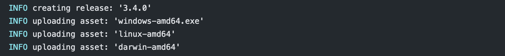

# git-release
[](LICENSE.md) [](https://github.com/anton-yurchenko/git-release/releases/latest)

A GitHub Action for creating a new GitHub Release with Assets and Changelog whenever a Version Tag is pushed to the project.  


## Features:
- Parse Tag to match Semantic Versioning.  
- Upload build artifacts (assets) to the release.  
- Add changelog to the release.  

## Manual:
1. Add your changes to **CHANGELOG.md** in the following format (according to [keepachangelog.com](https://keepachangelog.com/en/1.0.0/ "Keep a ChangeLog")):
```
## [2.1.5] - 2019-10-01
### Added
- Feature 1.
- Feature 2.

### Changed
- Logger timestamp.

### Removed
- Old library.
- Configuration file.
```
2. Tag a commit with Version (according to [semver.org](https://semver.org/ "Semantic Versioning")).
    - Extensions like **alpha/beta/rc/...** are not supported.
3. Push and watch **Git-Release** publishing a Release on GitHub ;-)  


## Configuration:
1. Change the workflow to be triggered on Tag Push:
```
on:
  push:
    tags:
    - '*'
```
or with `v` prefix:
```
on:
  push:
    tags:
    - 'v*'
```
2. Add Release stage to your workflow:
    - **Optional**: Provide a list of assets as **args**
    - **Optional**: `DRAFT_RELEASE: "true"/"false"` - Save release as draft instead of publishing it.
    - **Optional**: `PRE_RELEASE: "true"/"false"` - GitHub will point out that this release is identified as non-production ready. 
    - **Optional**: `CHANGELOG_FILE: "true"/"false"` - Changelog filename (default `CHANGELOG.md`)
```
    - name: Release
      uses: anton-yurchenko/git-release@v1
      env:
        GITHUB_TOKEN: ${{ secrets.GITHUB_TOKEN }}
        DRAFT_RELEASE: "false"
        PRE_RELEASE: "false"
        CHANGELOG_FILE: "CHANGELOG.md"
      with:
        args: |
          build/release/artifact-darwin-amd64.zip
          build/release/artifact-linux-amd64.zip
          build/release/artifact-windows-amd64.zip
```

## License
[MIT](LICENSE.md) © 2019-present Anton Yurchenko