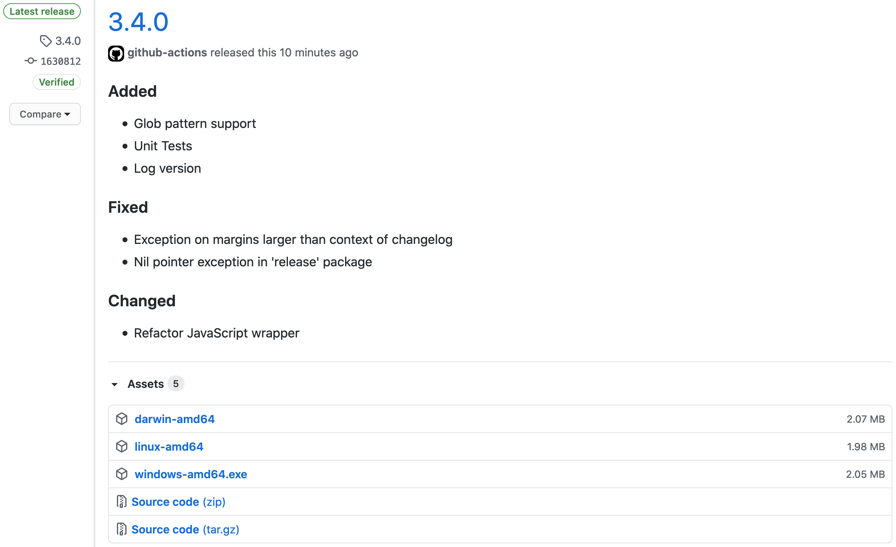

# git-release

[](https://github.com/anton-yurchenko/git-release/releases/latest)
[](https://codecov.io/gh/anton-yurchenko/git-release)
[](https://goreportcard.com/report/github.com/anton-yurchenko/git-release)
[](https://github.com/anton-yurchenko/git-release/actions/workflows/release.yml)
[](https://hub.docker.com/r/antonyurchenko/git-release)
[](LICENSE.md)

A **GitHub Action** for a **GitHub Release** creation with **Assets** and **Changelog** on new **Git Tag** in the repository.  



## Features

- Parse Tag to match [Semantic Versioning](https://semver.org/)
- Upload build artifacts (assets) to the release
- Publish release with changelog
    - [Keep a Changelog](https://keepachangelog.com/) Compliant
    - [Common Changelog](https://github.com/vweevers/common-changelog) Compliant
- Supported runners:
    - Linux AMD64
    - Linux ARM64
    - Windows
- Filename pattern matching
- Supports GitHub Enterprise
- Supports standard `v` prefix out of the box
- Allows custom SemVer prefixes

## Manual

1. Add changes to `CHANGELOG.md`. *For example:*

    ```markdown
    ## [3.4.0] - 2020-07-10
    ### Added
    - Glob pattern support
    - Unit Tests
    - Log version
    
    ### Fixed
    - Exception on margins larger than context of changelog
    - Nil pointer exception in 'release' package
    
    ### Changed
    - Refactor JavaScript wrapper
    
    ## [3.3.0] - 2020-06-27
    ### Added
    - Wrapper script: allow execution on Windows runners
    
    ### Changed
    - Action execution through Git: from Docker to NodeJS
    
    [3.4.0]: https://github.com/anton-yurchenko/git-release/compare/v3.3.0...v3.4.0
    [3.3.0]: https://github.com/anton-yurchenko/git-release/releases/tag/v3.3.0
    ```

2. Tag a commit with Version (according to [semver.org](https://semver.org/ "Semantic Versioning"))
3. Push and watch **Git-Release** publishing a Release on GitHub :wink:

    

## Configuration

1. Change the workflow to be triggered on Tag Push:
    - For example `'*'` or a more specific like `'v*'`:

    ```yaml
    on:
      push:
        tags:
        - "v[0-9]+.[0-9]+.[0-9]+"
    ```

2. Add Release step to your workflow:

    ```yaml
        - name: Release
          uses: docker://antonyurchenko/git-release:latest
          env:
            GITHUB_TOKEN: ${{ secrets.GITHUB_TOKEN }}
          with:
            args: build/*.zip
    ```

<details><summary>:information_source: All Configuration Options</summary>

- Provide a list of assets as `args` (divided by one of: `new line`, `space`, `comma`, `pipe`)
- `DRAFT_RELEASE (true/false as string)` - Save release as draft instead of publishing it (default `false`)
- `PRE_RELEASE (true/false as string)` - GitHub will point out that this release is identified as non-production ready (default: `false`)
- `CHANGELOG_FILE (string)` - Changelog filename (default: `CHANGELOG.md`)
  - Set to `none` in order to silence a warning message on missing changelog file
- `ALLOW_EMPTY_CHANGELOG (true/false as string)` - Allow publishing a release without changelog (default `false`)
- `TAG_PREFIX_REGEX (string)` - Provide a regex for a SemVer prefix, for example `[a-z-]*` in order to parse `prerelease-1.1.0`
- `RELEASE_NAME (string)` - Complete release title (may not be combined with RELEASE_NAME_PREFIX and RELEASE_NAME_SUFFIX)
- `RELEASE_NAME_PREFIX (string)` - Release title prefix
- `RELEASE_NAME_SUFFIX (string)` - Release title suffix

</details>  

<details><summary>:information_source: Windows Runners</summary>

Execute **git-release** through JavaScrip Wrapper on Windows Runners.

Example:

```yaml
    - name: Release
      uses: anton-yurchenko/git-release@master
      env:
        GITHUB_TOKEN: ${{ secrets.GITHUB_TOKEN }}
      with:
        args: |
            build\\darwin-amd64.zip
            build\\linux-amd64.zip
            build\\windows-amd64.zip
```

</details>

:information_source: [Configuration Examples](docs/example.md#examples)

## Remarks

- This action has multiple tags: `latest / v1 / v1.2 / v1.2.3`. You may lock to a certain version instead of using **latest**.  
(*Recommended to lock against a major version, for example* `v4`)
- Instead of using a pre-built Docker image, you may execute the action through JavaScript wrapper by changing `docker://antonyurchenko/git-release:latest` to `anton-yurchenko/git-release@master`
- `git-release` operates assets with pattern matching, this means that it is unable to validate whether an asset exists
- Docker image is published both to [**Docker Hub**](https://hub.docker.com/r/antonyurchenko/git-release) and [**GitHub Packages**](https://github.com/anton-yurchenko/git-release/packages). If you don't want to rely on **Docker Hub** but still want to use the dockerized action, you may switch from `uses: docker://antonyurchenko/git-release:latest` to `uses: docker://ghcr.io/anton-yurchenko/git-release:latest`
- Slashes (`/`) in asset filenames will be replaced with dashes (`-`)

## License

[MIT](LICENSE.md) © 2019-present Anton Yurchenko
