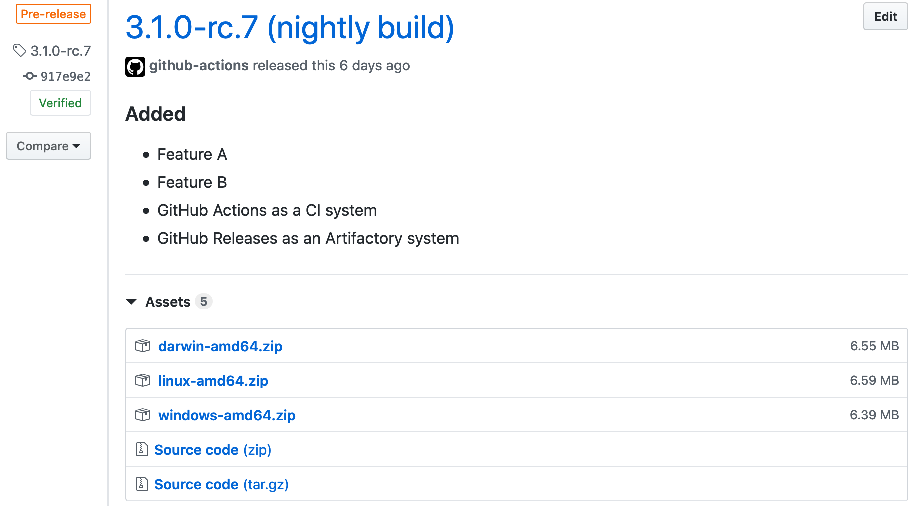
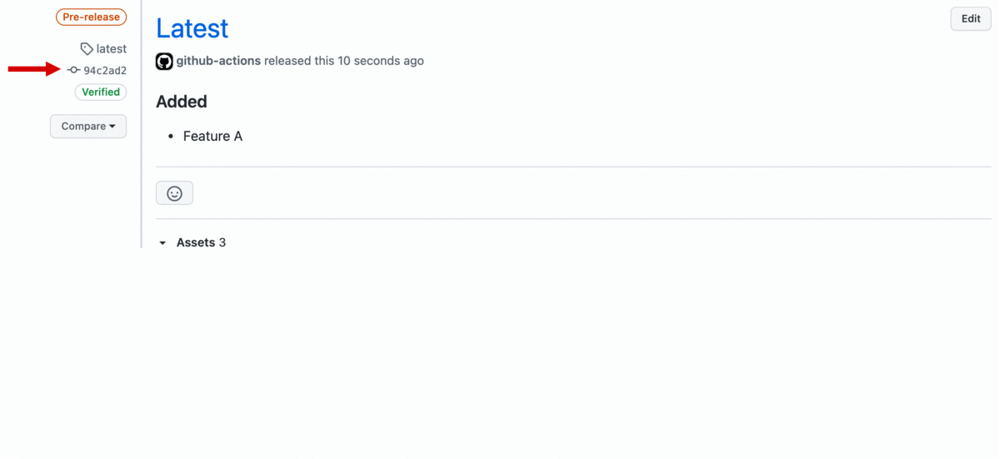
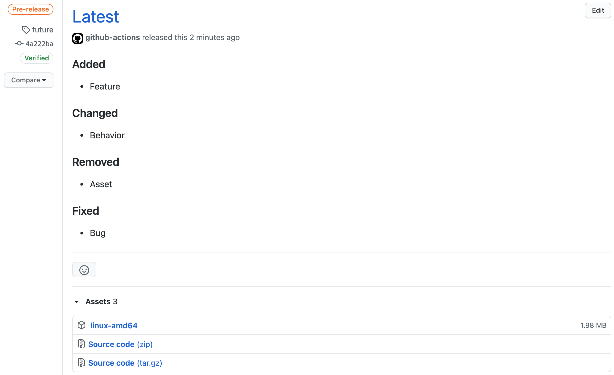

# Examples

- You may pass data between steps in a workflow using [environmental variables](https://help.github.com/en/actions/automating-your-workflow-with-github-actions/development-tools-for-github-actions#set-an-environment-variable-set-env)
- Some examples are based on `run` instruction, which may be easily replaces with another **GitHub Action**

## SemVer tag


<details><summary>Workflow</summary>

```yaml
name: release

on:
  push:
    tags:
      - "*"

jobs:
  build:
    runs-on: ubuntu-latest
    steps:
      - name: Checkout
        uses: actions/checkout@v2

      - name: Release
        uses: docker://antonyurchenko/git-release:latest
        env:
          GITHUB_TOKEN: ${{ secrets.GITHUB_TOKEN }}
        with:
          args: |
            darwin-amd64.zip
            linux-amd64.zip
            windows-amd64.zip
```

</details>

## Release title with prefix


<details><summary>Workflow</summary>

```yaml
name: release

on:
  push:
    tags:
      - "*"

jobs:
  build:
    runs-on: ubuntu-latest
    steps:
      - name: Checkout
        uses: actions/checkout@v2

      - name: Release
        uses: docker://antonyurchenko/git-release:latest
        env:
          GITHUB_TOKEN: ${{ secrets.GITHUB_TOKEN }}
          RELEASE_NAME_PREFIX: "Release: "
        with:
          args: |
            darwin-amd64.zip
            linux-amd64.zip
            windows-amd64.zip
```

</details>

## Release title with suffix



<details><summary>Workflow</summary>

```yaml
name: release

on:
  push:
    tags:
      - "*"

jobs:
  build:
    runs-on: ubuntu-latest
    steps:
      - name: Checkout
        uses: actions/checkout@v2

      - name: Release
        uses: docker://antonyurchenko/git-release:latest
        env:
          GITHUB_TOKEN: ${{ secrets.GITHUB_TOKEN }}
          PRE_RELEASE: "true"
          RELEASE_NAME_SUFFIX: " (nightly build)"
        with:
          args: |
            darwin-amd64.zip
            linux-amd64.zip
            windows-amd64.zip
```

</details>

## Release title with prefix and suffix


<details><summary>Workflow</summary>

Can be set as global environmental variables or provided directly to the action

```yaml
name: release

on:
  push:
    tags:
      - "*"

jobs:
  build:
    runs-on: ubuntu-latest
    steps:
      - name: Checkout
        uses: actions/checkout@v2

      - run: |
          export PREFIX="Release: "
          export SUFFIX=" (Codename: 'Ragnarok')"
          echo "::set-env name=RELEASE_NAME_PREFIX::$PREFIX"
          echo "::set-env name=RELEASE_NAME_SUFFIX::$SUFFIX"

      - name: Release
        uses: docker://antonyurchenko/git-release:latest
        env:
          GITHUB_TOKEN: ${{ secrets.GITHUB_TOKEN }}
        with:
          args: |
            darwin-amd64.zip
            linux-amd64.zip
            windows-amd64.zip
```

</details>

## Release title with different changelog file


<details><summary>Workflow</summary>

Can be set as global environmental variable or provided directly to the action

```yaml
name: release

on:
  push:
    tags:
      - "*"

jobs:
  build:
    runs-on: ubuntu-latest
    steps:
      - name: Checkout
        uses: actions/checkout@v2

      - run: |
          export TEXT="Release X"
          echo "::set-env name=RELEASE_NAME::$TEXT"

      - name: Release
        uses: docker://antonyurchenko/git-release:latest
        env:
          GITHUB_TOKEN: ${{ secrets.GITHUB_TOKEN }}
          CHANGELOG_FILE: "CHANGES.md"
          ALLOW_EMPTY_CHANGELOG: "true"
        with:
          args: |
            darwin-amd64.zip
            linux-amd64.zip
            windows-amd64.zip
```

</details>

## Asset Filename Pattern Matching


<details><summary>Workflow</summary>

```yaml
name: release

on:
  push:
    tags:
      - "*"

jobs:
  build:
    runs-on: ubuntu-latest
    steps:
      - name: Checkout
        uses: actions/checkout@v2

      - name: Release
        uses: docker://antonyurchenko/git-release:latest
        env:
          GITHUB_TOKEN: ${{ secrets.GITHUB_TOKEN }}
        with:
          args: build/*.zip
```

</details>

## Windows Runner


<details><summary>Workflow</summary>

```yaml
name: release

on:
  push:
    tags:
      - "*"

jobs:
  build:
    runs-on: windows-latest
    steps:
      - name: Checkout
        uses: actions/checkout@v2

      - name: Release
        uses: anton-yurchenko/git-release@master
        env:
          GITHUB_TOKEN: ${{ secrets.GITHUB_TOKEN }}
        with:
          args: |
            darwin-amd64.zip
            linux-amd64.zip
            windows-amd64.zip
```

</details>

## Unreleased

This will recreate a single released on each execution by deleting the previous release and creating a new one.
Changelog will be extracted from an `Unreleased` scope inside a CHANGELOG.md file.

Because this is an *"Unreleased"* release, it will always be marked as a **pre-release**.

`latest` tag will be used by default, this means that it will be moved with each execution and point to a different commit.



<details><summary>Workflow</summary>

```yaml
name: release

on:
  push:
    branches:
      - master

jobs:
  build:
    runs-on: ubuntu-latest
    steps:
      - name: Checkout
        uses: actions/checkout@v2

      - name: Release
        uses: docker://antonyurchenko/git-release:latest
        env:
          GITHUB_TOKEN: ${{ secrets.GITHUB_TOKEN }}
          UNRELEASED: "update"
        with:
          args: linux-amd64
```

</details>

## Unreleased with custom Tag

Identical to [Unreleased](#unreleased) but with a different git tag. (useful when `latest` tag is used for something else)



<details><summary>Workflow</summary>

```yaml
name: release

on:
  push:
    branches:
      - master

jobs:
  build:
    runs-on: ubuntu-latest
    steps:
      - name: Checkout
        uses: actions/checkout@v2

      - name: Release
        uses: docker://antonyurchenko/git-release:latest
        env:
          GITHUB_TOKEN: ${{ secrets.GITHUB_TOKEN }}
          UNRELEASED: "update"
          UNRELEASED_TAG: future
        with:
          args: linux-amd64
```

</details>
