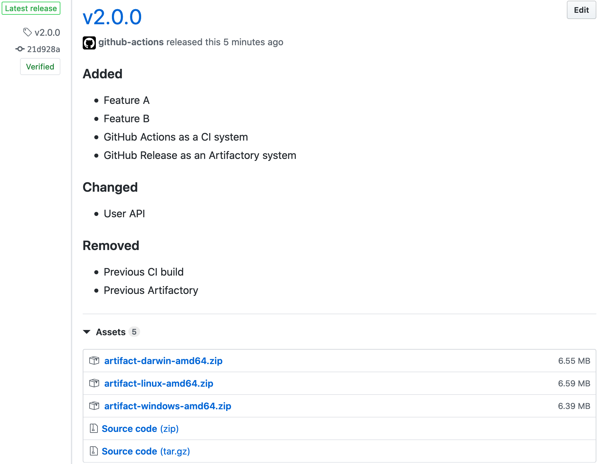
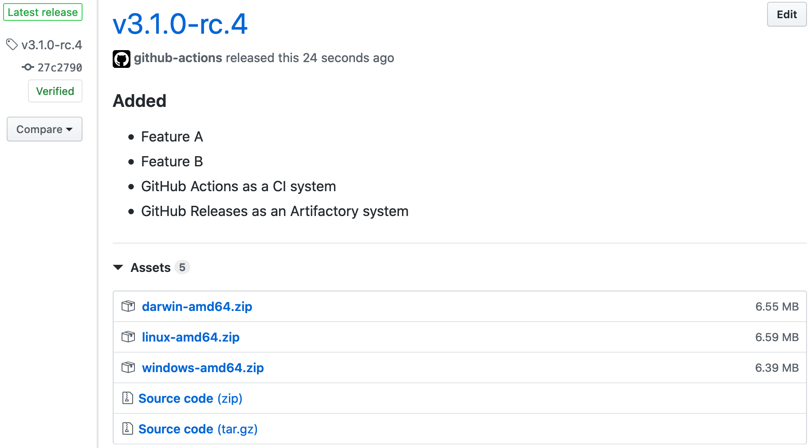
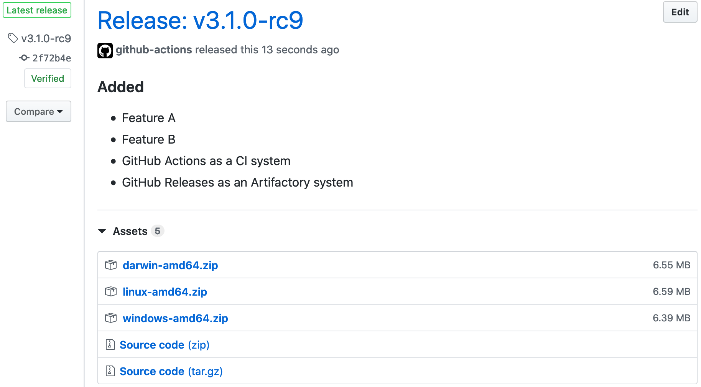
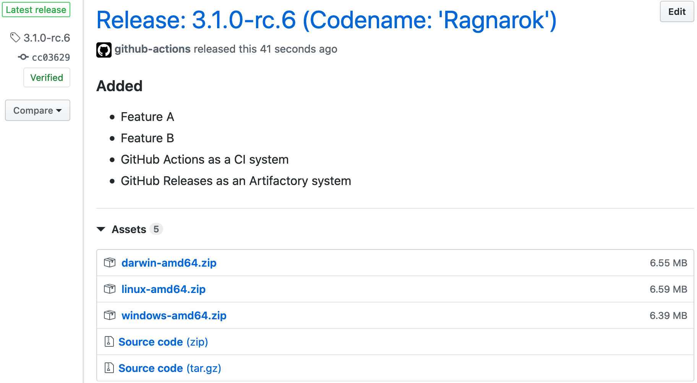
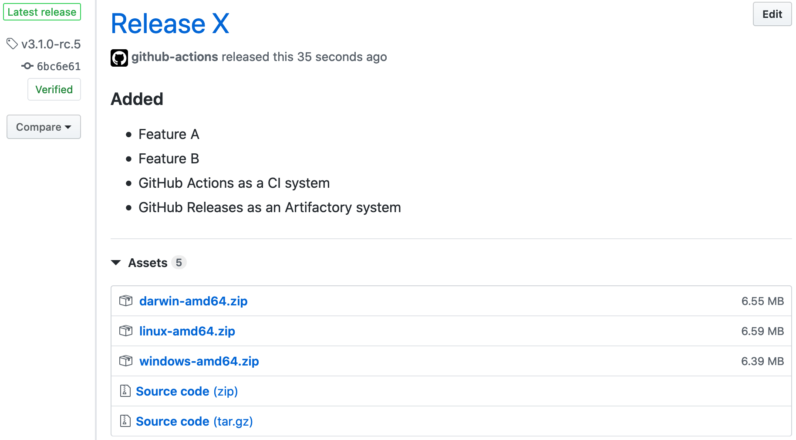

# Examples:
- You may pass data between steps in a workflow using [environmental variables](https://help.github.com/en/actions/automating-your-workflow-with-github-actions/development-tools-for-github-actions#set-an-environment-variable-set-env)
- Some examples are based on `run` instruction, which may be easily replaces with another **GitHub Action**

## Pure SemVer tag:


<details><summary>Workflow</summary>

```yaml
name: release

on:
  push:
    tags:
      - "*"

jobs:
  build:
    runs-on: ubuntu-latest
    steps:
      - name: Checkout
        uses: actions/checkout@v2

      - name: Release
        uses: docker://antonyurchenko/git-release:latest
        env:
          GITHUB_TOKEN: ${{ secrets.GITHUB_TOKEN }}
        with:
          args: |
            darwin-amd64.zip
            linux-amd64.zip
            windows-amd64.zip
```

</details>

## SemVer tag with prefix:


<details><summary>Workflow</summary>

```yaml
name: release

on:
  push:
    tags:
      - "*"

jobs:
  build:
    runs-on: ubuntu-latest
    steps:
      - name: Checkout
        uses: actions/checkout@v2

      - name: Release
        uses: docker://antonyurchenko/git-release:latest
        env:
          GITHUB_TOKEN: ${{ secrets.GITHUB_TOKEN }}
          ALLOW_TAG_PREFIX: "true"
        with:
          args: |
            darwin-amd64.zip
            linux-amd64.zip
            windows-amd64.zip
```

</details>

## Release title with prefix:


<details><summary>Workflow</summary>

```yaml
name: release

on:
  push:
    tags:
      - "*"

jobs:
  build:
    runs-on: ubuntu-latest
    steps:
      - name: Checkout
        uses: actions/checkout@v2

      - name: Release
        uses: docker://antonyurchenko/git-release:latest
        env:
          GITHUB_TOKEN: ${{ secrets.GITHUB_TOKEN }}
          ALLOW_TAG_PREFIX: "true"
          RELEASE_NAME_PREFIX: "Release: "
        with:
          args: |
            darwin-amd64.zip
            linux-amd64.zip
            windows-amd64.zip
```

</details>

## Release title with postfix:


<details><summary>Workflow</summary>

```yaml
name: release

on:
  push:
    tags:
      - "*"

jobs:
  build:
    runs-on: ubuntu-latest
    steps:
      - name: Checkout
        uses: actions/checkout@v2

      - name: Release
        uses: docker://antonyurchenko/git-release:latest
        env:
          GITHUB_TOKEN: ${{ secrets.GITHUB_TOKEN }}
          DRAFT_RELEASE: "false"
          PRE_RELEASE: "true"
          CHANGELOG_FILE: "CHANGELOG.md"
          ALLOW_EMPTY_CHANGELOG: "false"
          ALLOW_TAG_PREFIX: "false"
          RELEASE_NAME_POSTFIX: " (nightly build)"
        with:
          args: |
            darwin-amd64.zip
            linux-amd64.zip
            windows-amd64.zip
```

</details>

## Release title with prefix and postfix:


<details><summary>Workflow</summary>

```yaml
name: release

on:
  push:
    tags:
      - "*"

jobs:
  build:
    runs-on: ubuntu-latest
    steps:
      - name: Checkout
        uses: actions/checkout@v2

      - run: |
          export PREFIX="Release: "
          export POSTFIX=" (Codename: 'Ragnarok')"
          echo "::set-env name=RELEASE_NAME_PREFIX::$PREFIX"
          echo "::set-env name=RELEASE_NAME_POSTFIX::$POSTFIX"

      - name: Release
        uses: docker://antonyurchenko/git-release:latest
        env:
          GITHUB_TOKEN: ${{ secrets.GITHUB_TOKEN }}
        with:
          args: |
            darwin-amd64.zip
            linux-amd64.zip
            windows-amd64.zip
```

</details>

## Release title:


<details><summary>Workflow</summary>

```yaml
name: release

on:
  push:
    tags:
      - "*"

jobs:
  build:
    runs-on: ubuntu-latest
    steps:
      - name: Checkout
        uses: actions/checkout@v2

      - run: |
          export TEXT="Release X"
          echo "::set-env name=RELEASE_NAME::$TEXT"

      - name: Release
        uses: docker://antonyurchenko/git-release:latest
        env:
          GITHUB_TOKEN: ${{ secrets.GITHUB_TOKEN }}
          CHANGELOG_FILE: "CHANGELOG.md"
          ALLOW_EMPTY_CHANGELOG: "false"
          ALLOW_TAG_PREFIX: "true"
        with:
          args: |
            darwin-amd64.zip
            linux-amd64.zip
            windows-amd64.zip
```

</details>

## Asset Filename Pattern Matching:


<details><summary>Workflow</summary>

```yaml
name: release

on:
  push:
    tags:
      - "*"

jobs:
  build:
    runs-on: ubuntu-latest
    steps:
      - name: Checkout
        uses: actions/checkout@v2

      - name: Release
        uses: docker://antonyurchenko/git-release:latest
        env:
          GITHUB_TOKEN: ${{ secrets.GITHUB_TOKEN }}
        with:
          args: build/*.zip
```

</details>

## Windows Runner:


<details><summary>Workflow</summary>

```yaml
name: release

on:
  push:
    tags:
      - "*"

jobs:
  build:
    runs-on: windows-latest
    steps:
      - name: Checkout
        uses: actions/checkout@v2

      - name: Release
        uses: anton-yurchenko/git-release@master
        env:
          GITHUB_TOKEN: ${{ secrets.GITHUB_TOKEN }}
        with:
          args: |
            darwin-amd64.zip
            linux-amd64.zip
            windows-amd64.zip
```

</details>